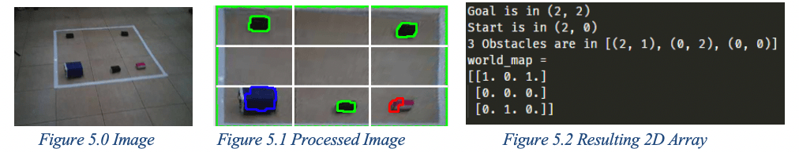
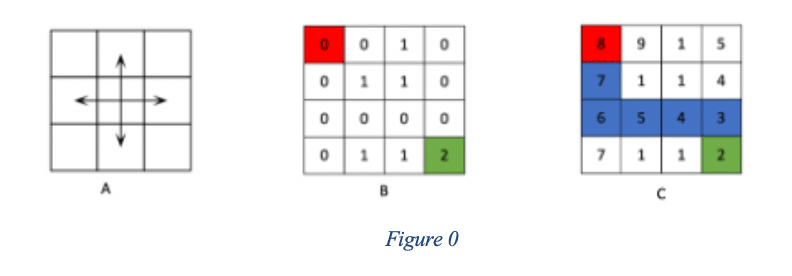

# Six-Paths
Six-paths was my group project for Robotics class. The project intended to build a multi-robot navigation system where an aerial robot (CoDrone) worked hand-in-hand with a ground robot (Lego EV3) to 'rescue' a target.

The drone captures image feed through its camera and then sends to the central server for image processing and object recognition. The resultant map and navigation information is then given to the Lego EV3 to help it navigate a field (with obstacles) and find the target.

## Installation
run `pip3 install -r requirements.txt`

## Run 
Run the program with `python3 six-paths.py`  
It runs the procedure on test image files in the `images` folder. 

## Process

## References and Tools
-   [Color Filtering](https://stackoverflow.com/questions/47483951/how-to-define-a-threshold-value-to-detect-only-green-colour-objects-in-an-image)
-   [HSV Color Picker Tool](https://github.com/alieldinayman/HSV-Color-Picker) 
-   [Drawing Lines in OpenCV](https://stackoverflow.com/questions/44816682/drawing-grid-lines-across-the-image-uisng-openccv-python?rq=1)
-   [Finding the center of Contour](https://www.pyimagesearch.com/2016/02/01/opencv-center-of-contour/)
-    [OpenCV uses different system for representing HSV](https://stackoverflow.com/questions/10948589/choosing-the-correct-upper-and-lower-hsv-boundaries-for-color-detection-withcv)
-   [Connecting edges from canny edge with dilation](https://stackoverflow.com/questions/43009923/how-to-complete-close-a-contour-in-python-opencv)

## Authors
- Kevin de Youngster
- Kofi Anamoa Mensah
- David Edem Duamekpor
- Kwamina Amoako

## Results
### What Worked?
- Capturing image feed from drone camera
- Processing image from drone camera into 2D grid map
- Object recognition with color filtering
- Sending map to EV3 via ssh
- EV3 navigating the field

### What did not Work?
- Concurrently taking image feed from drone (while flying) and navigating the EV3 ground robot.